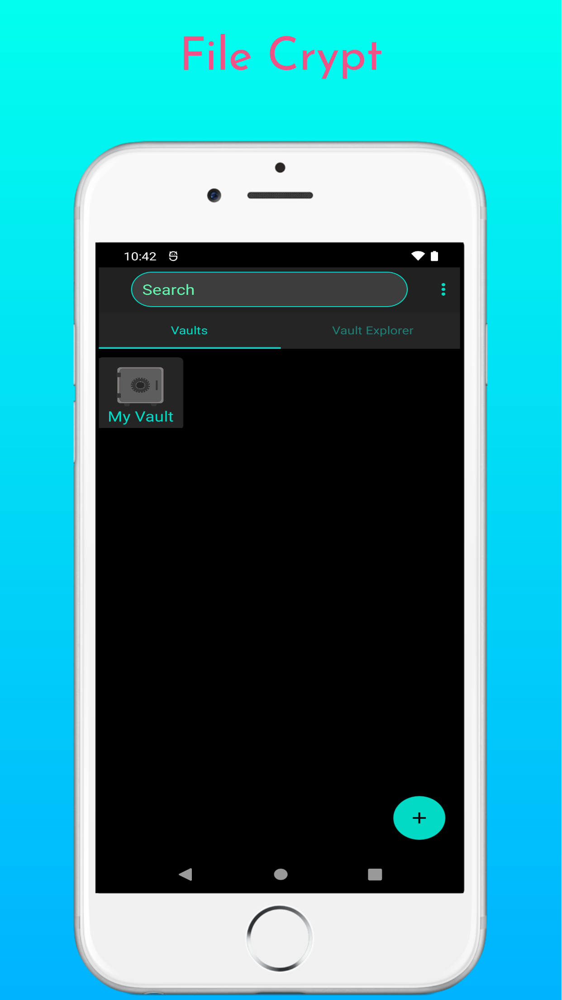
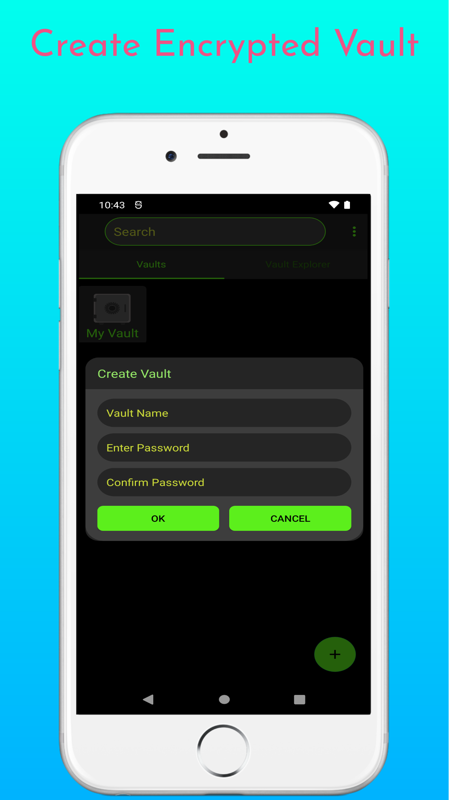
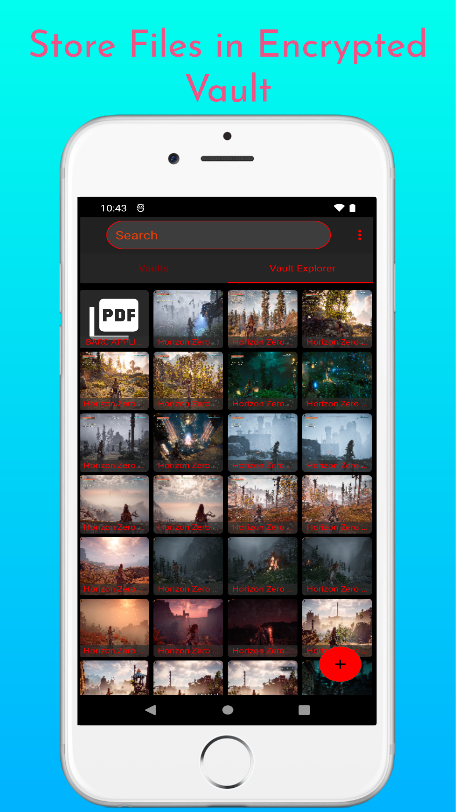

# File Crypt Native

File Crypt is a free as in freedom app for securely storing your files.
It creates an encrypted vault where you can store tour important files securely.
When you need your files again you can decrypt and move the files out of the vault.

